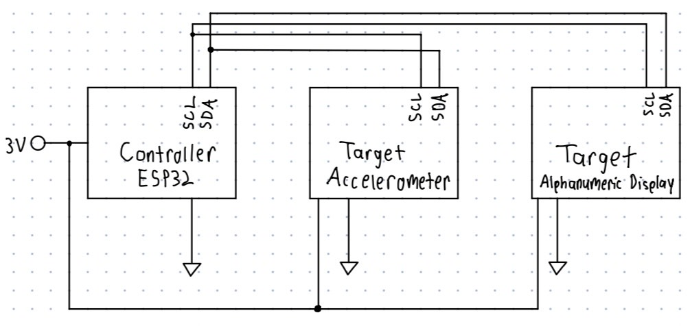
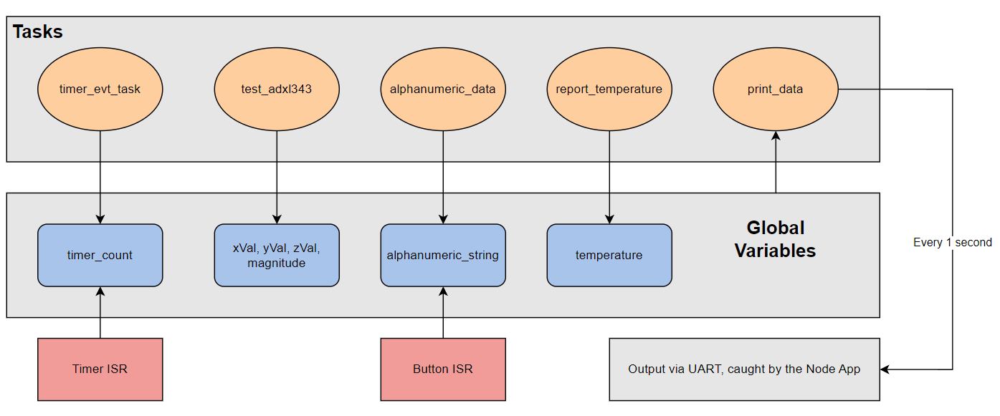
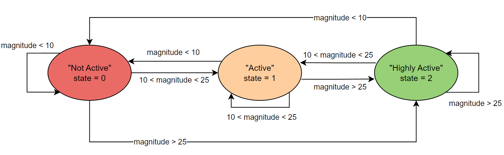

# Smart Cat Collar

Authors: Cristian Palencia, Yohan Kim, Zhilang Gui, Tanveer Dhilon

Date: 2024-10-03

### Summary
The quest is about creating a smart cat collar that records biometric data and displays it on a laptop as a chart in real time using Node.js and CanvasJS. The data displayed on the chart includes time, temperature, and activty type. An accelerometer was used to deteremine the activity level of the cat (Highly Active, Active, and Inactive). In addition to this, the Adafruit 14-Segment Alphanumeric LED was used to display the cat's name "Otto" along with information about the activity level and the time in the activity. The I2C bus was used to control both the alphanumeric display and the accelerometer, with each having their own address to communicate with the bus. A timer was also implemented using a timer interrupt handler that causes the timer to increment by 1 after a second has elasped. This would help us track the time the cat spent in any given activity. Some more key features of the collar include keeping track of the time of day, and the use of a button to trigger display of name and current activity and time in activity.

In order to get the quest to work we had several implementations:

1. Accelerometer

We were able to properly implement the accelerometer by using i2c communication. By properly formatting a set of instruction to read and write from the accelerometer we were able to acquire relevant x,y, and z acceleration values. In reading in these acceleration values we were able to compute a magnitude value that would be useful to us later on to properly categorize the cats activity level. Thus, we computed the magnitude with the following computation: magnitude = sqrt(x^2 + y^2 + z^2). 

2. Alphanumeric Display

The alphanumeric display was also implemented with i2c communication. Initially, this seemed like a difficult task since we were unsure about how to communicate with two different i2c devices at the same time. This, though, was a much easier task than we thought. Since each device has their own unique address, we can wire both up to the i2c pins (SCL and SDA) and simply when we go to write or read from either device, we simply specify the unique address of the relevant device we need to communicate to

To properly incorporate the Alphanumeric display we required the following:

* print "OTTO" to the display: This information is always displayed

* print activity type to the display: We can acquire the activity type by quantifying the acceleration magnitude. If acceleration is less 10 m/s^2 we would say that the cat is 'NOT ACTIVE'. If the acceleration is inbetween 10 and 25 m/s^2 we would say that the cat is 'ACTIVE'. Finally, if the acceleration is greater than 25 m/s^2 then we would say that the cat is 'HIGHLY ACTIVE'.

* display time in any given activity to the display: We would use a general purpose timer that is triggered every second in order to keep track of the time spent in any given activity. If the cat ever changed its activity state, the timer would be reset to represent that the cat has now entered a new state and we want to keep track of how long it spent in said state.

The general idea was that we could format all three pieces of information into a string and then loop through the string (in a sliding manner) on the alphanumeric display. As long as we had this string we could display it by looping through and grabbing 4 characters at a time. The 4 characters would be converted to a relevant 16 bit number that would be written over i2c to the alphanumeric display. 

3. Button

The button was implemented by connecting it to one of the GPIO pins on the ESP32. Then, button and interrupt on the button pin were configured. A button interrupt handler was also created in order to set the flag when the button is pressed. This in turn triggers the alphanumeric display to show the cat's name, current activty, and time in activty. 

4. Thermistor

To properly read the external temperature we a voltage divider circuit that would incorporate a thermistor. The thermistor functions by changing resistance as the temperature changes. Thus, if we set up a voltage divider with a known input voltage (in this case 3.3V) and a measured analog reading (using another ADC GPIO pin), we can properly solve for the variable resistance of the thermistor and then convert that resistance into a temperature (in degrees C). We can solve for the variable resistance by using the equation for a voltage divider. Then using the computed resistance we can use Steinhart's equation to convert that into a usable temperature.

5. Node app

A node app sets Node.js server that serves an index.html file and establishes a real-time connection with an ESP32 via a serial port. It uses the SerialPort library to read data from the ESP32 and parses it using the ReadlineParser. The server also integrates Socket.io to enable real-time communication with the front-end (the index.html page). Data received from the ESP32 is processed, formatted into a structured object with time, value, and activity fields, and then sent to the client via Socket.io in real-time.

6. index.html

The index.html file is a front-end interface that visualizes real-time data using CanvasJS to plot the incoming data points on a line chart. The data is received in real-time from the Node.js server using Socket.io. The chart tracks "Cat Temperature and Activity Data" with time displayed on the x-axis and temperature values on the y-axis. After receiving data from the server via the sensorUpdate event, the file extracts the time, temperature, and activity type from the incoming data. Each data point is represented as a circle on the chart and color-coded based on the activity type: green for "Highly Active", orange for "Active", and red for "Not Active."

7. Buzzer

The buzzer/micromotor was implemented by wiring the buzzer to the L293D motor driver along with the ESP32. micromotor or a buzzer using an L293D motor driver with an ESP32, you can wire the motor/buzzer to the driver and control the driver using the ESP32's GPIO pins. This is done so we can properly ensure that we are using the buzzer without damaging it. In general using an H Bridge is useful in PWM and motor application to ensure safe usage without damaging components. Thus we can use software to send control signals to the H Bridge in order to control wether the buzzer is on or off. Currently our buzzer simply turns on and off every second and will be used in greater detail in the next quest.

### Solution Design

Describe how you built your solution. Use hardware and software
diagrams, show data flow, include control flow or state charts if
appropriate.


#### Hardware Design
The system integrates several key sensors and components:

Thermistor: Thermistor connected using a voltage divider and ADC readings for temperature conversion.
Aphanumeric Display I2C : An alphanumeric display connected to the I2C bus used to display data.
Accelerometer I2C: An accelerometer connected to the I2C to measure x, y, and z acceleration values.

<p align="center">

</p>
<p align="center">
I2C Diagram
</p>

Button: A button connected to a GPIO pin and ground used to trigger the alphanumeric display to show data.
Buzzer and LD293D Driver: A buzzer controlled by LD293D Driver (H Bridge) that buzzes on and off (to be built upon in the next quest).


#### Software Design 

##### 1. Task Implementation
We implement a set of software tasks that each were in charge of performing their own set of detailed behaviors

- timer_evt_task(): This function uses a general purpose timer in order to perform a task every one second. Whenever we recognize that the timer has an event in its queue we will increment a global "timer_count" variable by one. This variable is extremely useful for determining how long the cat is in any given activity.

- test_adxl343(): In charge of reading in accelerometer data in the form of x,y, and z acceleration. From which it converts those three values into a acceleration magnitude value. Using this acceleration value, we will determine the corresponding state in which the cat is in. Depending on the range of the acceleration values we will determine whether the cat is 'NOT ACTIVE', 'ACTIVE', or 'HIGHLY ACTIVE'. Depending on whether the cat changed its activity type we will reset the tiemr as needed to properly reflect that the cat entered a new activity.

- alphanumeric_data(): The alphanumeric task is in charge of displaying three things to the 14 segment display. It will display the cat name ("OTTO"), the cat's current activity ('NOT ACTIVE', 'ACTIVE' or 'HIGHLY ACTIVE'), and the time spent in any given activity ("timer_count"). Since the given string for this will always be greater than 4 characters we implemented a sliding behavior for the display. In order to do this we formatted a string with all the relevant data and looped through the entire string grabbing for characters at a time. Every set of four characters would be passed into a helper function that would translate a given a character into its corresponding 16bit 14 segment display code. By doing this we can properly display and monitor relevant data to the alphanumeric display.

- report_temperature(): this task is taken from the previous quest. In summary, it acquires an analog reading from a thermistor and uses relevant voltage divider and Steinhart equations to convert the analog reading into a relevant temperature reading.

- print_data(): This task is extremely relevant in sending data over serial for the node app to process. It prints data in the following format "{temperature} {activity type}". Since the state and temperature are global variables we can simply print this data out every second for the node app to collect and process into a graphical interface using CanvasJS.

##### 2. Interrupts
- Button ISR: A hardware interrupt is triggered when the button is pressed, initializing the alphanumeric display. Any successive presses will simply reset the activity timer.
- Timer ISR: The general purpose timer response to a timer interrupt that populates a queue structure. When the queue structure is populated we will recognize this interrupt in our timer task and properly handle it every second.

##### 3. Alphanumeric Display Logic
- We implemented one import function that would allow us to convert any necessary function to a corresponding 16 bit output code for the 14 segment display. The charToSegment function takes in a corresponding character and performs the conversion using a simple switch statement.

##### 4. Node App functionality and Data Retrieval (serial UART)
The Node.js server is responsible for Data Retrieval from the ESP32 device via a serial UART interface and Real-time Data Transmission to the front-end using Socket.io.

1. Data Retrieval from the ESP32 Device The Node app uses the SerialPort library to communicate with the ESP32 at a baud rate of 115200 on a specified COM port. Data received from the ESP32, formatted as "0.00 activity", is parsed using ReadlineParser. The values are split into a numeric sensor value and an activity description, then structured into a data object.

2. Real-time Data Transmission to the Front-end The server uses Socket.io to send the formatted data as a sensorUpdate event to all connected clients in real-time. The front-end, which uses CanvasJS, listens for these updates and plots the incoming data points on a line chart dynamically.

3. Server Setup and Client Interaction A server hosts the index.html file on port 3000. When accessed, the HTML page establishes a WebSocket connection to receive and render the real-time data visually. By integrating SerialPort for data handling and Socket.io for real-time communication, the Node app serves as an efficient bridge between the ESP32 and the web-based visualization interface.

##### 5. Data Flow and Output
<p align="center">

Code Flow Chart: Shows the relationship between tasks, global variables, and hardware interrupts
</p>


<p align="center">

State Diagram of Activity Status
</p>


### Quest Summary
In this quest, we were successfully able to create a smart cat collar that records biometric data and displays it on a laptop as a chart in real time using Node.js and CanvasJS. The data displayed on the chart includes time, temperature, and activty type. By pressing a button, the user is also able to display the cat's name, activty status, and time of activty on the alphanumeric display. The accelerometer was used to measure the activty level of the cat by computing the magnitude of the accelerations. The buzzer also rung when activity is detected. Some challanges we faced during this quest include figurimg out how to connect multiple sensors to the I2C bus and figuring out how to use the buzzer.


### Supporting Artifacts
- [Link to video technical presentation](https://drive.google.com/file/d/1aFpp11RI6BVutXHhoSuAp_-T2tGB8Q2R/view?usp=drive_link). Not to exceed 120s
- [Link to video demo](https://drive.google.com/file/d/1fDqN_OaTaeUsbGNRtM6CE7A8nKshv5VA/view?usp=sharing). Not to exceed 120s

### Self-Assessment 

| Objective Criterion | Rating | Max Value  | 
|---------------------------------------------|:-----------:|:---------:|
| Objective One | 1 |  1     | 
| Objective Two | 1 |  1     | 
| Objective Three | 1 |  1     | 
| Objective Four | 1 |  1     | 
| Objective Five | 1 |  1     | 
| Objective Six | 1 |  1     | 
| Objective Seven | 1 |  1     | 


### AI and Open Source Code Assertions

- We have documented in our code readme.md and in our code any software that we have adopted from elsewhere
- We used AI for coding and this is documented in our code as indicated by comments "AI generated" 

ChatGPT Snippets:
- how to write one byte of data from a specified register:
```c
// Write one byte to a register
int writeRegister(uint8_t reg, uint8_t data) {
  i2c_cmd_handle_t cmd = i2c_cmd_link_create();
  i2c_master_start(cmd);
  i2c_master_write_byte(cmd, (SLAVE_ADDR << 1) | WRITE_BIT, ACK_CHECK_EN);
  i2c_master_write_byte(cmd, reg, ACK_CHECK_EN);
  i2c_master_write_byte(cmd, data, ACK_CHECK_EN);
  i2c_master_stop(cmd);
  int ret = i2c_master_cmd_begin(I2C_EXAMPLE_MASTER_NUM, cmd, 1000 / portTICK_PERIOD_MS);
  i2c_cmd_link_delete(cmd);
  return ret;
}
```

- how to read one byte of data from a specified register:
```c
// Read one byte from a register
uint8_t readRegister(uint8_t reg) {
  uint8_t data;
  i2c_cmd_handle_t cmd = i2c_cmd_link_create();
  i2c_master_start(cmd);
  i2c_master_write_byte(cmd, (SLAVE_ADDR << 1) | WRITE_BIT, ACK_CHECK_EN);
  i2c_master_write_byte(cmd, reg, ACK_CHECK_EN);
  i2c_master_start(cmd);
  i2c_master_write_byte(cmd, (SLAVE_ADDR << 1) | READ_BIT, ACK_CHECK_EN);
  i2c_master_read_byte(cmd, &data, ACK_CHECK_DIS);
  i2c_master_stop(cmd);
  int ret = i2c_master_cmd_begin(I2C_EXAMPLE_MASTER_NUM, cmd, 1000 / portTICK_PERIOD_MS);
  i2c_cmd_link_delete(cmd);
  return data;
}
```

- how to read 16 bits
```c
int16_t read16(uint8_t reg) {
    uint8_t data[2];
    i2c_cmd_handle_t cmd = i2c_cmd_link_create();
    i2c_master_start(cmd);
    i2c_master_write_byte(cmd, (SLAVE_ADDR << 1) | WRITE_BIT, ACK_CHECK_EN);
    i2c_master_write_byte(cmd, reg, ACK_CHECK_EN);
    i2c_master_start(cmd);
    i2c_master_write_byte(cmd, (SLAVE_ADDR << 1) | READ_BIT, ACK_CHECK_EN);
    i2c_master_read(cmd, data, 2, ACK_CHECK_DIS);
    i2c_master_stop(cmd);
    int ret = i2c_master_cmd_begin(I2C_EXAMPLE_MASTER_NUM, cmd, 1000 / portTICK_PERIOD_MS);
    i2c_cmd_link_delete(cmd);

    // Combine the two bytes into one 16-bit integer
    return (int16_t)((data[1] << 8) | data[0]);
}
```

- how to process data
```javascript
  const currentTime = new Date().toLocaleTimeString('en-US', { hour12: false });
  const [floatValue, ...remaining] = data.trim().split(' ');
  const remainingString = remaining.join(' ');
```

- how increase PWM duty cycle for buzzer
```c
  buzzer_on();  // Turn on the buzzer

  // Gradually increase PWM duty cycle to vary the tone
  for (int duty = 0; duty <= 255; duty++) {
      ledc_set_duty(LEDC_MODE, LEDC_CHANNEL, duty);
      ledc_update_duty(LEDC_MODE, LEDC_CHANNEL);
      vTaskDelay(pdMS_TO_TICKS(10)); // Delay for smooth tone change
  }

  vTaskDelay(pdMS_TO_TICKS(1000)); // Wait for 1 second

  buzzer_off(); // Turn off the buzzer
  ledc_set_duty(LEDC_MODE, LEDC_CHANNEL, 0); // Stop PWM
  ledc_update_duty(LEDC_MODE, LEDC_CHANNEL);

  vTaskDelay(pdMS_TO_TICKS(1000)); // Wait for 1 second
``